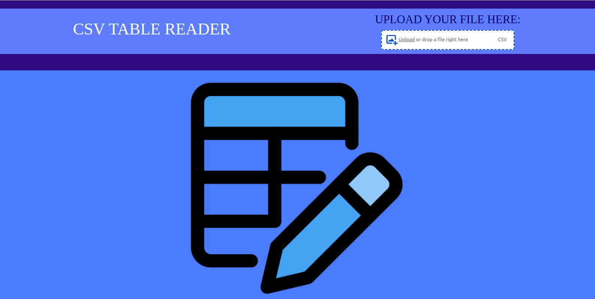
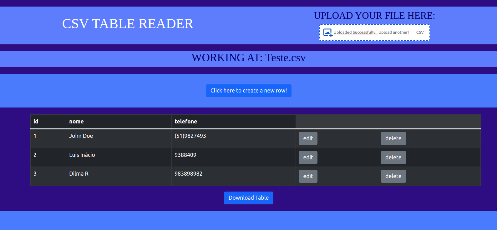

# DESAFIO TÉCNICO INTELIGOV

## RESUMO DO PROJETO

-O projeto consiste em uma aplicação, que recebe o upload de um aquivo csv, renderização do arquivo como uma tabela html, com possibilidades de adição de novas linhas, exclusão e atualiação.

## Tecnologias Utilizadas

#### :link: [React.js](https://pt-br.reactjs.org/)
#### :link: [React-Bootstrap](https://react-bootstrap.github.io/)
#### :link: [Papaparse](https://www.npmjs.com/package/papaparse)
#### :link: [File-saver](https://www.npmjs.com/package/file-saver)
#### :link: [React drag drop files](https://www.npmjs.com/package/react-drag-drop-files)

## Instalação

-Clone o repositório através da seguinte chave https: `https://github.com/tuliotrindade/desafio-inteligov.git`.

-Entre na pasta `csv-table-reader` utilizando o seguinte comando na pasta raiz: `cd csv-table-reader`

-Instale as dependências através do `npm install`.

-Inicie a aplicação com o comando `npm start`

## Funcionamento

-A pagina renderizada inicialmente se consiste apenas em um cabeçalho que permite o uploade de um arquivo csv

-Após o upload do arquivo, a tabela será renderizada juntamente com com todas as opções para alterações da mesma

-Aplicação com todas as opções de alteração em aberto

## Contato 

Túlio Trindade - tuliotrindade99@gmail.com
